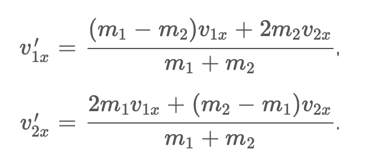

# Particle interaction model
## Intro
Этот проект представлялся на МНСК-2021.

Проект выполнен на ЯП **Python**.

Для работы требует установленных модулей *numpy* и *pygame*.

## Demo
### Взаимодействие идентичных частиц

### Добавление частицы высокой массы (как следствие - высокого импульса)

### Взаимодействие двух частиц
    purple particle - масса 5 условных единиц
    red particle - масса 1000 условных единиц

## Physic
### Принципиальная схема упругого соударения двух тел

### Ортогональные компоненты результирующих скоростей
    Вертикальные составляющие

    Горизонтальные составляющие

### Распределение Максвелла

